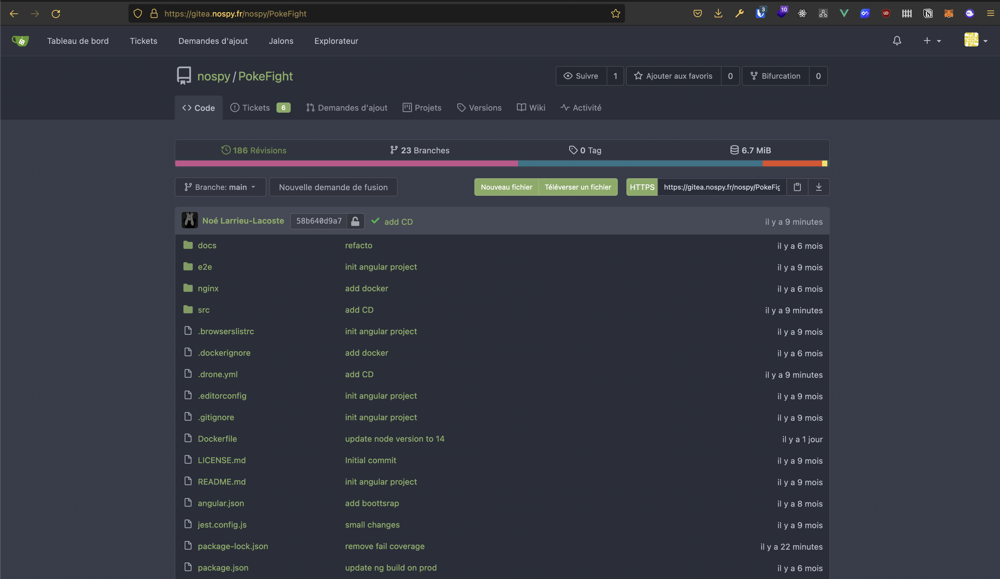

# Réalisation d'une intégration continue dans un environnement cloud

# Introduction


[Slides de Présentation](./slides.pdf)

L'objectif de ce projet était de monter un stack d'intégration continue sur une infrastructure cloud.

L'idée de base était de "mettre en place un serveur git". 

C'était la première idée sélectionnée., une fois ce serveur en place et fonctionnel, nous avons pu rajouter des services par-dessus. 

Ainsi, beaucoup de services d'intégration continue viennent se greffer sur note serveur Gitea. L'objectif était déjà d'avoir notre propre ecosystème d'intégration /déploiement continue, en ayant la main sur tout les services présents.

Les applications qui sont finalement mises en place :

- Gitea
- SonarQube
- Drone CI
- Docker registry

Les systèmes d'hébergement qui ont été utilisé :

- AWS
- DigitalOcean
- ScaleWay
- Pulse Heberg

Les services mis en place:

- AWS Elastic File System
- AWS Relational Database Service
- AWS Elastic Beanstalk with Docker
- AWS Route 53
- ScaleWay Simple Service Storage
- ScaleWay Docker Registry
- Digital Ocean Droplet with Docker (SonarQube)
- PulseHeberg Instance with Docker (Drone CI)

# Accès aux services

- Gitea => https://gitea.nospy.fr/
- SonarQube => https://sonarqube.les-evades-du-chenil.dog/
- Drone CI => https://drone.nospy.fr/
- Application en déploiement continue (pokefight) => https://pokemon.nospy.fr/

# Découpage des applicatifs

## Gitea

La stack gitea est majoritairement hébergé sur AWS.

L'instance Gitea est lancé dans un conteneur docker.

Nous utilisons des **instances ec2** lancées via **elastic beanstalk** avec des instructions spécifiques pour pouvoir exploiter Docker.

Un loadbalancer combiné avec route 53 (service AWS de gestion des noms de domaines, DNS et certificats SSL) nous permet d’accéder à l'application via le web avec une URL défini et protégé par un certificat SSL.

Les volumes de gitea sont monté sur **E.F.S. elastic file system** service de gestion de fichiers d'Amazon.

Les gros fichiers comme les archives, les images ... gitea proposent d'utiliser un service basé sur le protocole S3 pour stocker ses fichiers. Nous utilisons cette solution en combinaison avec le système S3 object storage de **Scaleway**.

Pour la base de données gitea propose plusieurs solutions. La solution que nous avons sélectionnée est **PostgreSQL**, qui fonctionne grâce à **AWS RDS**.

La stack gitea est majoritairement hébergé sur AWS

### Fonctionnement

Gitea fonctionne comme les autres serveurs git, il permet même d'importer des projets de ses concurrents.

Cela nous a permis d'alimenter rapidement notre serveur avec des dépôts de projets personnels qui se prête bien à l'intégration continue

Quand on ouvre un projet, on arrive sur cette interface :



Chaque utilisateur a aussi accès à un fil d'actualité des projets auquel il se réfère.


### Docker Registry

Pour héberger notre registre docker, nous utilisons un service ches Scaleway.

Nous avons fait ce choix car le tier gratuit assez généreux en terme de stockage. On se sert de ce registre pour stocker les images de nos applications qui ont pu être générés via des intégrations continues sur certains dépôts. 

On s'en sert également pour faire du déploiement continu, grâce à la combinaison de **Drone CI** et **PulseHeberg**.


### Drone CI

Drone CI est un outil d'intégration continue qui vient se plugger sur Gitea ou autre serveur git. 

Il permet de définir des steps pour organiser des opérations de lancement de build, de test, de déploiement ou d'appel à des services externes (SonarQube dans notre exemple).

Pour les détails à propos du DNS et de la configuration SSL c'est quelque chose qui est géré par **caddy**.

Drone CI est séparé en deux parties :

- Un applicatif web (Drone CI)
- Des runners qui permettent l'exécution des étapes. Dans notre cas nous avons 2 runners.
  - Un présent sur le même serveur que l'applicatif web, et qui couvre quasiment tout les cas d'usages
  - Un présent sur un serveur personnel, plus puissant, et qui permet d'exécuter des taches plus lourdes que le premier ne peut pas faire (ex : des build d'applications Angular qui sont très consommateur en mémoire (+2Go)).

Exemple d'utilisation de Drone :


Sur ces images on voit le déroulement d'un build en 5 étapes :

1. Clonage du projet Git
2. Création et envoie d'un rapport à SonarQube
3. Lancement des tests unitaires
4. Lancement du build de l'image docker et push sur le registre Docker (**ScaleWay**)
5. Déploiement de la nouvelle image sur un serveur **PulseHeberg**

Cela nous permet d'avoir le déroulement suivant :


#### Interaction avec Gitea

Lorsque l'on veut initialiser un dépôt dans drone, ce dernier va en réalité créer un Webhook dans Gitea pour qu'il soit prévenu en cas de nouveau commit pour lancer un build.


#### Fichier de configuration

La configuration d'un build Drone se fait dans un fichier `drone.yml`.

```yml
kind: pipeline
name: build image and push to registry
type: docker

steps:
  - name: install dependencies
    image: node:14
    commands:
      - npm ci
  - name: generate coverage report
    image: node:14
    failure: ignore
    commands:
      - npm test
  - name: SonarQube
    image: aosapps/drone-sonar-plugin
    settings:
      sonar_host: https://sonarqube.les-evades-du-chenil.dog
      sonar_token:
        from_secret: SONAR_TOKEN
  - name: test
    image: node:14
    commands:
      - npm test
  - name: build & push
    image: plugins/docker
    settings:
      username: nologin
      password:
        from_secret: REGISTRY_TOKEN
      repo: rg.fr-par.scw.cloud/gitea/pokefight
      registry: rg.fr-par.scw.cloud/gitea
  - name: deploy new image
    image: plugins/webhook
    settings:
      urls:
        from_secret: SERVICE_WEBHOOK
      method: POST
      debug: true

node:
  location: home
```

La définition des secrets se fait dans drone sur cette interface :


## SonarQube

SonarQube est un outil qui permet d'inspecter la qualité du code, sa sécurité, la couverture des tests, ...

L'applicatif SonarQube est hébergé sur **un droplet** chez **DigitalOcean**. Il fonctionne lui aussi sur une stack docker avec un **PostgreSQL** local.

Pour les détails à propos du DNS et de la configuration SSL c'est quelque chose qui est géré par **caddy**.

`docker-compose.yml`

```yml
version: "3"

services:
  sonarqube:
    image: sonarqube:community
    depends_on:
      - db
    environment:
      SONAR_JDBC_URL: jdbc:postgresql://db:5432/sonar
      SONAR_JDBC_USERNAME: xxxx
      SONAR_JDBC_PASSWORD: xxxx
    volumes:
      - sonarqube_data:/opt/sonarqube/data
      - sonarqube_extensions:/opt/sonarqube/extensions
      - sonarqube_logs:/opt/sonarqube/logs
    ports:
      - "9122:9000"
  db:
    image: postgres:12
    environment:
      POSTGRES_USER: sonar
      POSTGRES_PASSWORD: sonar
    volumes:
      - postgresql:/var/lib/postgresql
      - postgresql_data:/var/lib/postgresql/data

volumes:
  sonarqube_data:
  sonarqube_extensions:
  sonarqube_logs:
  postgresql:
  postgresql_data:
```


### Configuration des rapports de couverture de tests

Dans un projet Java, il suffit d'installer la dépendance **Jacoco**, qui créé un rapport de couverture de test exploitable par **SonarQube**.

Dans le cas d'un projet sonar-project.properties, il faut configurer quelques options supplémentaires (demander à Jest de générer un rapport, installer une dépendance spécial de sonar, **jest-sonar-reporter** pour avoir un rapport interprétable) et créer un fichier de configuration **sonar-project.properties** pour l'aider à identifier tout ça :

```ini
sonar.language=ts
sonar.sources=src
sonar.tests=src
sonar.testExecutionReportPaths=test-report.xml
sonar.javascript.lcov.reportPaths=coverage/lcov.info
sonar.inclusions=src/**/*.ts
sonar.exclusions=**/node_modules/**,**/*.spec.ts,**/*.test.ts
sonar.test.inclusions=**/*.spec.ts,**/*.test.ts
```

## S3

S3 (Simple Service Storage) est à l'origine un service d'AWS qui propose du stockage d'objet à travers le web. C'est un produit qui a été très populaire et beaucoup de concurrents ont créé des API qui fonctionnent de la même manière et qui sont compatibles avec l'API S3 d'AWS.

C'est le cas de **ScaleWay**, nous avons donc choisi de mettre en place le service de stockage des fichiers volumineux et des archives sur un stockage S3 chez eux afin d'alléger la charge du stockage local chez AWS (EFS).

C'est quelque chose de configurable dans les paramètres de Gitea que de pouvoir déplacer le stockage des fichiers volumineux, qui sont appelés depuis le navigateur de l'utilisateur sur un bucket S3.

# Détail étape par étape

La première brique que nous avons mise en place est le Gitea sur AWS. 

Nous avons commencé par mettre en place les différents modules chacun de notre côté (RDS et S3). 

Ensuite, nous nous sommes réunis pour mettre en place l'instance Gitea. 

Nous avons fait une tentative avec ECS (Elastic Container Service) mais on s'est très vite rendu compte que c'était hors du tier gratuit. On s'est donc ravisé et on s'est servis d'Elastic Beanstalk pour faire tourner l'image docker de Gitea sur une instance EC2.


L'un des passages obligé d'AWS, c'est les groupes de sécurité et les VPC. Dans notre cas, nous avons un VPC qui contient l'instance AWS. Nous mettons des images de la configuration des VPC et des groupes de sécurité en annexe, car il y en a beaucoup :

- Un VPC qui contient "tout"
- Un groupe de sécurité pour le load balancer
- Un groupe de sécurité pour l'instance EC2 (Elastic Beanstalk)
- Un groupe de sécurité pour la base de donnée (PostgreSQL via RDS)
- Un groupe de sécurité pour l'EFS (le système de fichier qui accueil les volumes de gitea)

Voici quelques configurations importantes :

La configuration du VPC qui contient tout l'écosystème


La configuration de la base de donnée sur Amazon RDS


La configuration DNS (le domaine a été acheté sur ovh)


Une fois ceci mis en place, nous avons cherché des utilitaires qui se greffait sur Gitea.

Nous savions que nous recherchions un outils d'analyse de code et un outil de build.

Pour l'outil d'analyse de code, on a fait au plus classique car l'un des seul open source est SonarQube.

On héberge cette instance de SonarQube sur **Digital Ocean**. L'un d'entre nous possédait déjà un serveur SonarQube mais nous voulions un service intégré au projet.

Pour l'outil de build par contre, nous nous sommes aperçu que Gitea s'interfaçait bien avec des "petits" outils de build.
Premièrement, nous avons regardé Agola qui est un petit outil de build. Cependant, il demande de faire appel à un service externe pour l'authentification. Ensuite, nous avons regardé du coté de Drone CI et l'outil nous a conquis, à la fois simple et puissant avec un belle interface graphique.

Une fois Drone CI en place, on a décidé de mettre en place un registre Docker pour pouvoir stocker les images construites avec Drone CI.

Drone CI est aussi lié à SonarQube, c'est a dire qu'il lance un scan sur les commit et lui transmet le rapport.

# Annexe

## Configuration des groupes de sécurités :

### Load Balancer


### EC2


### RDS


### EFS


## Configuration Elastic Beanstalk

### Architecture du dossier


### Lancement Docker

`Dockerrun.aws.json`

```json
{
  "AWSEBDockerrunVersion": "1",
  "Image": {
    "Name": "gitea/gitea:latest",
    "Update": "true"
  },
  "Ports": [
    {
      "ContainerPort": 3000,
      "HostPort": 3000
    }
  ],
  "Volumes": [
    {
      "HostDirectory": "/gitea/data",
      "ContainerDirectory": "/data"
    }
  ]
}

```

### .elasticbeanstalk

`config.yml`

```yml
branch-defaults:
  main:
    environment: giteaesgi-env
global:
  application_name: gitea-esgi
  branch: main
  default_ec2_keyname: null
  default_platform: Docker running on 64bit Amazon Linux 2
  default_region: eu-central-1
  include_git_submodules: true
  instance_profile: null
  platform_name: null
  platform_version: null
  profile: eb-cli
  repository: null
  sc: git
  workspace_type: Application
```

### .ebextensions

`alb-http-to-https-redirection.config`

```yml
Resources:
  AWSEBV2LoadBalancerListener:
    Type: AWS::ElasticLoadBalancingV2::Listener
    Properties:
      LoadBalancerArn:
        Ref: AWSEBV2LoadBalancer
      Port: 80
      Protocol: HTTP
      DefaultActions:
        - Type: redirect
          RedirectConfig:
            Host: "#{host}"
            Path: "/#{path}"
            Port: "443"
            Protocol: "HTTPS"
            Query: "#{query}"
            StatusCode: "HTTP_301"

```

`storage-efs-mountfilesystem.config`

```yml
option_settings:
  aws:elasticbeanstalk:application:environment:
    FILE_SYSTEM_ID: 'fs-0d392a7309096c187'
    MOUNT_DIRECTORY: '/gitea'

##############################################
#### Do not modify values below this line ####
##############################################

packages:
  yum:
    amazon-efs-utils: []

commands:
  01_mount:
    command: "/tmp/mount-efs.sh"

files:
  "/tmp/mount-efs.sh":
      mode: "000777"
      content : |
        #!/bin/bash

        EFS_MOUNT_DIR=$(/opt/elasticbeanstalk/bin/get-config environment -k MOUNT_DIRECTORY)
        EFS_FILE_SYSTEM_ID=$(/opt/elasticbeanstalk/bin/get-config environment -k FILE_SYSTEM_ID)

        echo "Mounting EFS filesystem ${EFS_FILE_SYSTEM_ID} to directory ${EFS_MOUNT_DIR} ..."

        echo 'Stopping NFS ID Mapper...'
        service rpcidmapd status &> /dev/null
        if [ $? -ne 0 ] ; then
            echo 'rpc.idmapd is already stopped!'
        else
            service rpcidmapd stop
            if [ $? -ne 0 ] ; then
                echo 'ERROR: Failed to stop NFS ID Mapper!'
                exit 1
            fi
        fi

        echo 'Checking if EFS mount directory exists...'
        if [ ! -d ${EFS_MOUNT_DIR} ]; then
            echo "Creating directory ${EFS_MOUNT_DIR} ..."
            mkdir -p ${EFS_MOUNT_DIR}
            if [ $? -ne 0 ]; then
                echo 'ERROR: Directory creation failed!'
                exit 1
            fi
        else
            echo "Directory ${EFS_MOUNT_DIR} already exists!"
        fi

        mountpoint -q ${EFS_MOUNT_DIR}
        if [ $? -ne 0 ]; then
            echo "mount -t efs -o tls ${EFS_FILE_SYSTEM_ID}:/ ${EFS_MOUNT_DIR}"
            mount -t efs -o tls ${EFS_FILE_SYSTEM_ID}:/ ${EFS_MOUNT_DIR}
            if [ $? -ne 0 ] ; then
                echo 'ERROR: Mount command failed!'
                exit 1
            fi
            chmod 777 ${EFS_MOUNT_DIR}
            runuser -l  ec2-user -c "touch ${EFS_MOUNT_DIR}/it_works"
            if [[ $? -ne 0 ]]; then
                echo 'ERROR: Permission Error!'
                exit 1
            else
                runuser -l  ec2-user -c "rm -f ${EFS_MOUNT_DIR}/it_works"
            fi
        else
            echo "Directory ${EFS_MOUNT_DIR} is already a valid mountpoint!"
        fi

        echo 'EFS mount complete.'
```

## Configuration Caddy

`CaddyFile`

```json
www.drone.nospy.fr {
        redir https://drone.nospy.fr{uri}
}

drone.nospy.fr {
        reverse_proxy localhost:8881
}
```

